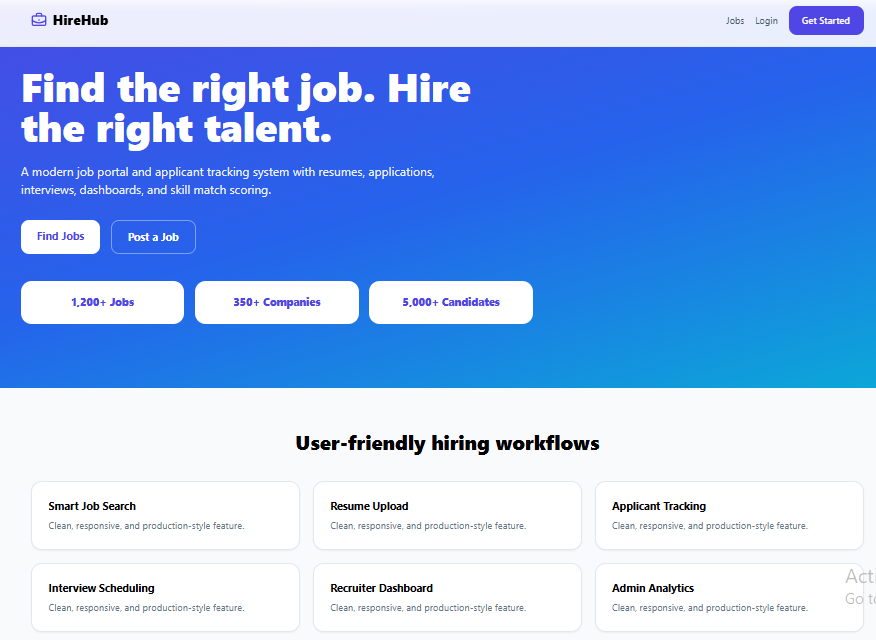

<div align="center">

# 💼 HireHub ATS  
### 🚀 Smart Job Portal & Applicant Tracking System


<br/>


<br/>

**A production-quality MERN applicant tracking system with candidate, recruiter, and admin workflows.**

<br/>


</div>

---

## 📸 Project Preview

<div align="center">



</div>

> ⚠️ Make sure the image path is exactly: `screenshots/Hirehub.PNG`  
> GitHub is case-sensitive, so `Hirehub.PNG`, `hirehub.png`, and `HireHub.PNG` are different file names.

---

## 🌟 Overview

**HireHub ATS** is a modern **full-stack MERN job portal and applicant tracking system** built for real-world recruitment workflows.

The platform supports three main roles:

- 👨‍💼 **Candidates** can search jobs, upload resumes, save jobs, apply to jobs, and track application status.
- 🏢 **Recruiters** can post jobs, manage applicants, shortlist/reject candidates, and schedule interviews.
- 🛡️ **Admins** can manage users, jobs, applications, and view platform analytics.

This project is designed as a **portfolio-quality Full Stack Developer project** with strong focus on:

✅ Clean UI  
✅ Role-based dashboards  
✅ Secure authentication  
✅ Real-world business logic  
✅ Resume upload  
✅ Application tracking  
✅ Interview scheduling  
✅ Skill match scoring  

---

## 🎯 Project Purpose

This project was built to demonstrate professional MERN stack development skills for internship and junior developer roles.

| Target Role | What This Project Shows |
|---|---|
| 💻 Full Stack Developer | React frontend, Express backend, MongoDB models, REST APIs |
| 🎨 Frontend Developer | Responsive UI, dashboards, reusable components, Tailwind CSS |
| ⚙️ Backend Developer | Authentication, validations, role-based access, file upload |
| 🧑‍💼 Real-World Product Thinking | Recruitment workflows, applicant tracking, admin analytics |

---

## ✨ Key Features

### 👤 Candidate Features

- 🔐 Register and login as candidate
- 👨‍💻 Candidate dashboard
- 📝 Candidate profile management
- 📄 Resume PDF upload
- 🧠 Add skills
- 🎓 Add education details
- 💼 Add work experience
- 🔎 Search and filter jobs
- 📌 Save jobs
- 🚀 Apply to jobs
- 📨 Submit cover letter
- 📊 Track application status
- 📅 View interview schedules

---

### 🏢 Recruiter Features

- 🔐 Register and login as recruiter
- 🏢 Company profile management
- 📢 Post new jobs
- ✏️ Edit own jobs
- 🗑️ Delete own jobs
- 🔓 Open / close job posts
- 👥 View applicants
- 📄 View candidate resume
- ⭐ View candidate match score
- ✅ Shortlist candidates
- ❌ Reject candidates
- 📅 Schedule interviews
- 📝 Add recruiter notes
- 📊 Recruiter dashboard analytics

---

### 🛡️ Admin Features

- 👑 Admin dashboard
- 👥 View all users
- 👨‍💼 Manage candidates
- 🏢 Manage recruiters
- 💼 Manage jobs
- 📄 Manage applications
- 🔒 Activate / deactivate users
- 🗑️ Delete users or jobs
- 📊 View analytics charts
- 🕒 View recent platform activity

---

### 🧰 Tech Stack

| Layer             | Technology                       |
| ----------------- | -------------------------------- |
| 🎨 Frontend       | React, Vite                      |
| 💅 Styling        | Tailwind CSS                     |
| 🧭 Routing        | React Router                     |
| 🔗 API Client     | Axios                            |
| 📊 Charts         | Recharts                         |
| 🎯 Icons          | Lucide React                     |
| 🔔 Notifications  | React Toastify                   |
| ⚙️ Backend        | Node.js, Express.js              |
| 🗄️ Database      | MongoDB, Mongoose                  |
| 🔐 Authentication | JWT, bcryptjs                    |
| 📁 File Upload    | Multer                           |
| 📧 Email          | Nodemailer                       |
| 🛡️ Security      | Helmet, CORS, express-rate-limit   |
| ✅ Validation      | express-validator               |


---


### 🎨 UI / UX Highlights

- 💎 Modern SaaS-style landing page
- 🎨 Indigo + cyan gradient theme
- 🧩 Card-based layouts
- 📊 Dashboard analytics cards
- 🏷️ Color-coded status badges
- 📱 Responsive design
- 🔔 Toast notifications
- 🌀 Loading states
- 📭 Empty states
- 🧭 Role-based navigation
- 🔒 Protected dashboard routes


---


## 🏗️ System Architecture

```text
┌──────────────────────────┐
│      React Frontend       │
│   Vite + Tailwind CSS     │
└─────────────┬────────────┘
              │
              │ REST API + JWT
              ▼
┌──────────────────────────┐
│     Express Backend       │
│ Auth + Validation + APIs  │
└─────────────┬────────────┘
              │
              │ Mongoose ODM
              ▼
┌──────────────────────────┐
│        MongoDB            │
│ Users / Jobs / Profiles   │
│ Applications / Saved Jobs │
└──────────────────────────┘


---

## 📁 Project Structure

```text
hirehub-ats/
├── frontend/
│   ├── src/
│   │   ├── components/
│   │   ├── context/
│   │   ├── pages/
│   │   │   ├── candidate/
│   │   │   ├── recruiter/
│   │   │   └── admin/
│   │   ├── services/
│   │   ├── utils/
│   │   ├── App.jsx
│   │   ├── main.jsx
│   │   └── index.css
│   ├── package.json
│   ├── .env.example
│   ├── index.html
│   ├── tailwind.config.js
│   └── postcss.config.js
│
├── backend/
│   ├── src/
│   │   ├── config/
│   │   ├── controllers/
│   │   ├── middleware/
│   │   ├── models/
│   │   ├── routes/
│   │   ├── utils/
│   │   ├── uploads/
│   │   ├── app.js
│   │   └── server.js
│   ├── package.json
│   └── .env.example
│
├── docs/
│   ├── API_DOCUMENTATION.md
│   ├── DATABASE_SCHEMA.md
│   ├── SYSTEM_ARCHITECTURE.md
│   └── VALIDATION_RULES.md
│
├── screenshots/
│   └── Hirehub.PNG
│
├── docker-compose.yml
├── README.md
└── .gitignore


```


### 👨‍💻 Author


<div align="center">

Lithira Liyanage
Full Stack Developer | MERN Stack Developer

</div>

---


